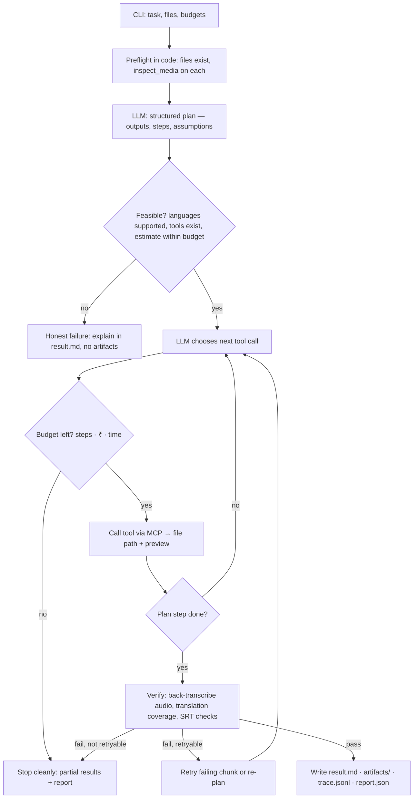

# Agent flow

```mermaid
flowchart TD
  A[CLI: task, files, budgets] --> B[Preflight in code: files exist, inspect_media on each]
  B --> C[LLM: structured plan — outputs, steps, assumptions]
  C --> D{Feasible? languages supported, tools exist, estimate within budget}
  D -- no --> X[Honest failure: explain in result.md, no artifacts]
  D -- yes --> E[LLM chooses next tool call]
  E --> F{Budget left? steps · ₹ · time}
  F -- no --> P[Stop cleanly: partial results + report]
  F -- yes --> G[Call tool via MCP → file path + preview]
  G --> H{Plan step done?}
  H -- no --> E
  H -- yes --> V[Verify: back-transcribe audio, translation coverage, SRT checks]
  V -- fail, retryable --> R[Retry failing chunk or re-plan] --> E
  V -- fail, not retryable --> P
  V -- pass --> W[Write result.md · artifacts/ · trace.jsonl · report.json]
```
