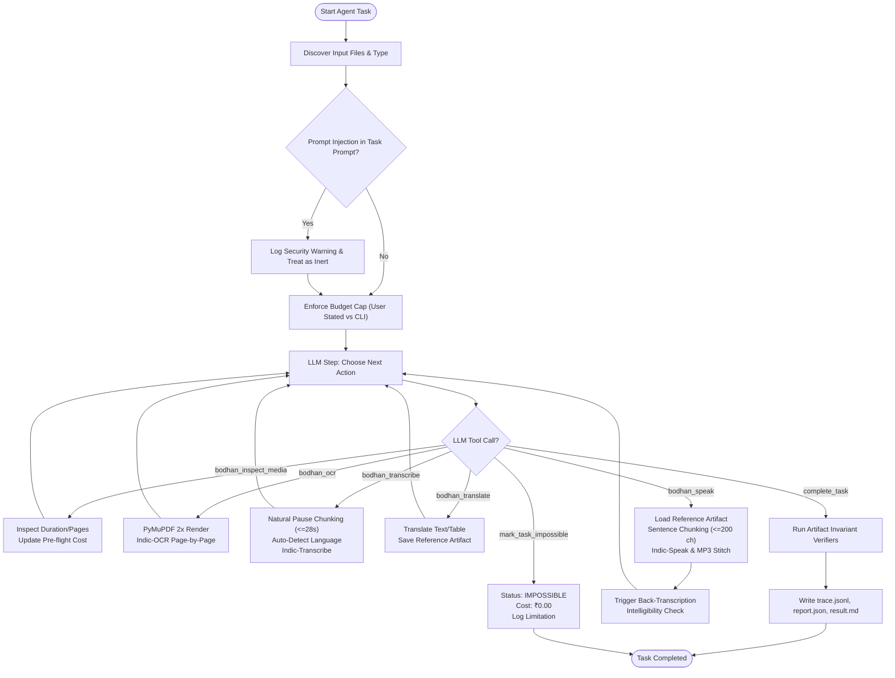

# Agent Flow Chart

```mermaid
flowchart TD
    Start(["Start Agent Task"]) --> FindFiles["Discover Input Files & Type"]
    FindFiles --> InjectionCheck{"Prompt Injection in Task Prompt?"}
    InjectionCheck -- Yes --> LogInjection["Log Security Warning & Treat as Inert"]
    InjectionCheck -- No --> BudgetCap["Enforce Budget Cap (User Stated vs CLI)"]
    LogInjection --> BudgetCap

    BudgetCap --> LLMLoop["LLM Step: Choose Next Action"]
    
    LLMLoop --> Decides{"LLM Tool Call?"}
    
    Decides -- "mark_task_impossible" --> Impossible["Status: IMPOSSIBLE\nCost: ₹0.00\nLog Limitation"]
    
    Decides -- "bodhan_inspect_media" --> MediaInfo["Inspect Duration/Pages\nUpdate Pre-flight Cost"]
    MediaInfo --> LLMLoop

    Decides -- "bodhan_ocr" --> OCR["PyMuPDF 2x Render\nIndic-OCR Page-by-Page"]
    OCR --> LLMLoop

    Decides -- "bodhan_transcribe" --> Transcribe["Natural Pause Chunking (<=28s)\nAuto-Detect Language\nIndic-Transcribe"]
    Transcribe --> LLMLoop

    Decides -- "bodhan_translate" --> Translate["Translate Text/Table\nSave Reference Artifact"]
    Translate --> LLMLoop

    Decides -- "bodhan_speak" --> Speak["Load Reference Artifact\nSentence Chunking (<=200 ch)\nIndic-Speak & MP3 Stitch"]
    Speak --> AutoBackTranscribe["Trigger Back-Transcription\nIntelligibility Check"]
    AutoBackTranscribe --> LLMLoop

    Decides -- "complete_task" --> Verify["Run Artifact Invariant Verifiers"]
    
    Verify --> Finalize["Write trace.jsonl, report.json, result.md"]
    Finalize --> Done(["Task Completed"])
    Impossible --> Done
```
