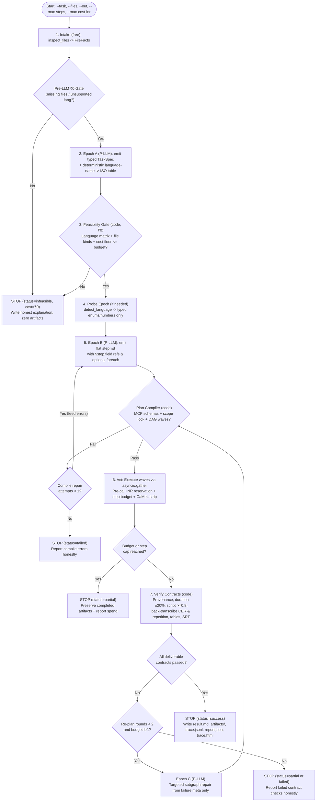

# Agent Loop Flowchart — Plan, Act, Verify, Retry, Stop

```mermaid
flowchart TD
    START(["Start: --task, --files, --out, --max-steps, --max-cost-inr"])
    INTAKE["1. Intake (free): inspect_files -> FileFacts"]
    PREGATE{"Pre-LLM ₹0 Gate<br/>(missing files / unsupported lang?)"}
    EPOCHA["2. Epoch A (P-LLM): emit typed TaskSpec<br/>+ deterministic language-name -> ISO table"]
    GATE{"3. Feasibility Gate (code, ₹0)<br/>Language matrix + file kinds + cost floor <= budget?"}
    INFEASIBLE["STOP (status=infeasible, cost=₹0)<br/>Write honest explanation, zero artifacts"]
    PROBE["4. Probe Epoch (if needed)<br/>detect_language -> typed enums/numbers only"]
    EPOCHB["5. Epoch B (P-LLM): emit flat step list<br/>with $step.field refs & optional foreach"]
    COMPILE{"Plan Compiler (code)<br/>MCP schemas + scope lock + DAG waves?"}
    REPAIR{"Compile repair<br/>attempts < 1?"}
    COMPILE_FAIL["STOP (status=failed)<br/>Report compile errors honestly"]
    EXEC["6. Act: Execute waves via asyncio.gather<br/>Pre-call INR reservation + step budget + CaMeL strip"]
    BUDGET{"Budget or step<br/>cap reached?"}
    PARTIAL["STOP (status=partial)<br/>Preserve completed artifacts + report spend"]
    VERIFY["7. Verify Contracts (code)<br/>Provenance, duration ±20%, script >=0.8,<br/>back-transcribe CER & repetition, tables, SRT"]
    ALLPASS{"All deliverable<br/>contracts passed?"}
    REPLAN_CHK{"Re-plan rounds < 2<br/>and budget left?"}
    EPOCHC["Epoch C (P-LLM)<br/>Targeted subgraph repair from failure meta only"]
    SUCCESS["STOP (status=success)<br/>Write result.md, artifacts/, trace.jsonl, report.json, trace.html"]
    FAIL_FINAL["STOP (status=partial or failed)<br/>Report failed contract checks honestly"]

    START --> INTAKE --> PREGATE
    PREGATE -- "No" --> INFEASIBLE
    PREGATE -- "Yes" --> EPOCHA --> GATE
    GATE -- "No" --> INFEASIBLE
    GATE -- "Yes" --> PROBE --> EPOCHB --> COMPILE
    COMPILE -- "Fail" --> REPAIR
    REPAIR -- "Yes (feed errors)" --> EPOCHB
    REPAIR -- "No" --> COMPILE_FAIL
    COMPILE -- "Pass" --> EXEC --> BUDGET
    BUDGET -- "Yes" --> PARTIAL
    BUDGET -- "No" --> VERIFY --> ALLPASS
    ALLPASS -- "Yes" --> SUCCESS
    ALLPASS -- "No" --> REPLAN_CHK
    REPLAN_CHK -- "Yes" --> EPOCHC --> COMPILE
    REPLAN_CHK -- "No" --> FAIL_FINAL
```
