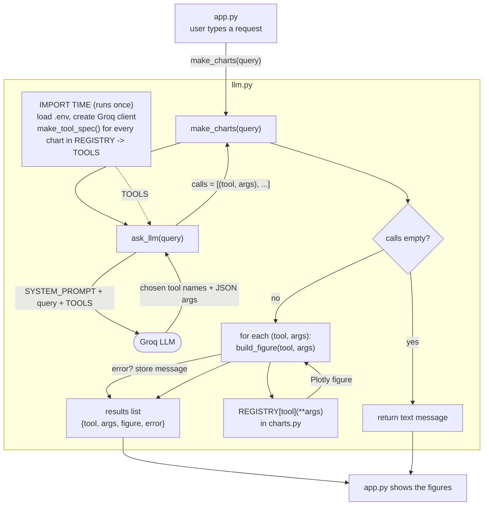

# llm.py flow

```mermaid
flowchart TD
    A["app.py<br/>user types a request"] -->|"make_charts(query)"| B

    subgraph LLM["llm.py"]
        S["IMPORT TIME (runs once)<br/>load .env, create Groq client<br/>make_tool_spec() for every chart in REGISTRY -> TOOLS"]
        B["make_charts(query)"] --> C["ask_llm(query)"]
        C -->|"SYSTEM_PROMPT + query + TOOLS"| G(["Groq LLM"])
        G -->|"chosen tool names + JSON args"| C
        C -->|"calls = [(tool, args), ...]"| B
        B --> D{"calls empty?"}
        D -- yes --> T["return text message"]
        D -- no --> E["for each (tool, args):<br/>build_figure(tool, args)"]
        E --> F["REGISTRY[tool](**args)<br/>in charts.py"]
        F -->|"Plotly figure"| E
        E -->|"error? store message"| R
        E --> R["results list<br/>{tool, args, figure, error}"]
    end

    S -.->|"TOOLS"| C
    R --> H["app.py shows the figures"]
    T --> H
```
